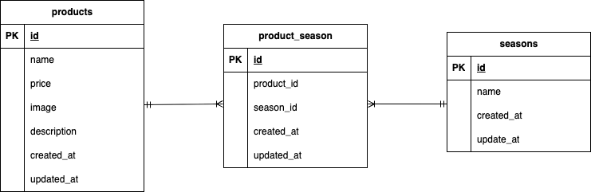

# アプリケーション名

mogitate

##　環境構築
-git clone git@github.com:Estra-Coachtech/laravel-docker-template.git
-docker-compose up -d --build

## Laravel 環境構築

-docoker-compose exec php bash
-composer install
-cp .env.example .env
-php artisan key:generate

## 使用技術

-PHP8.1.33
-MySQL:8.0.26
-nginx:1.21.1

## ER 図

